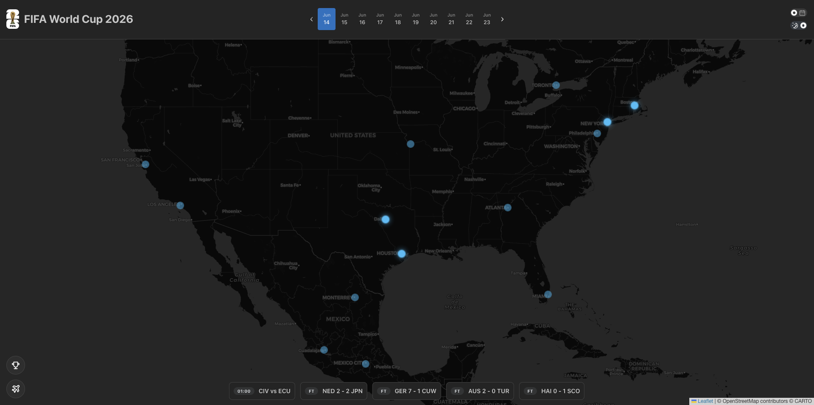
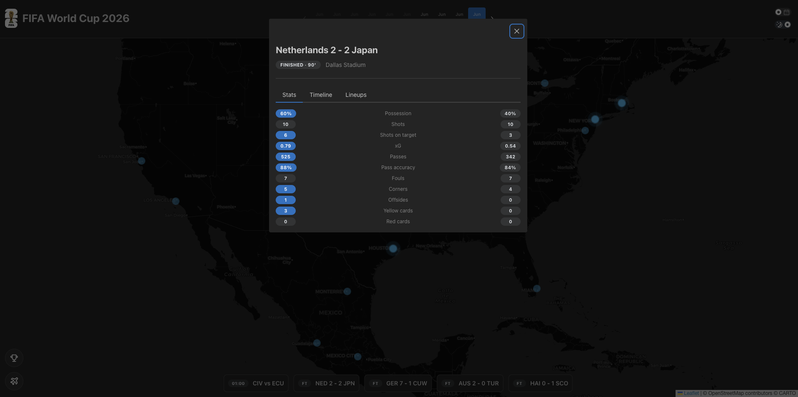
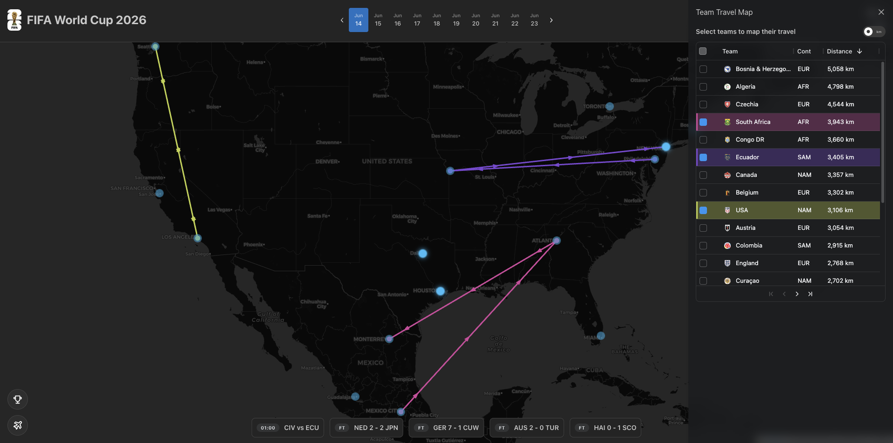
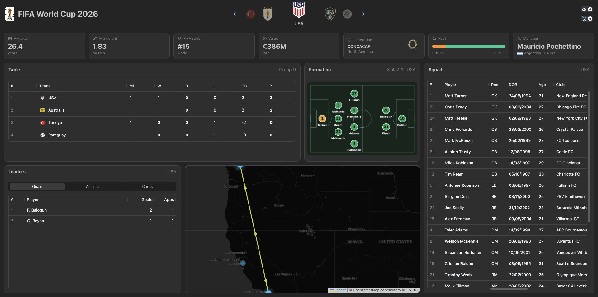
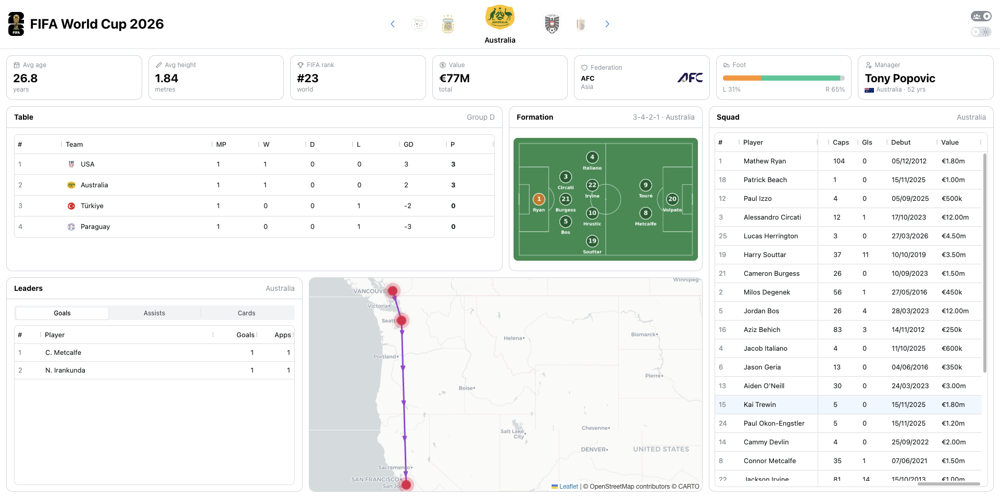
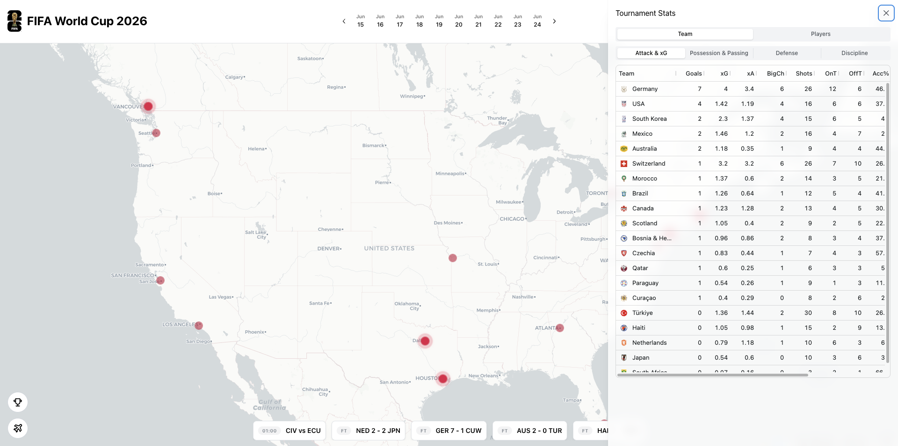

# FIFA World Cup 2026 — Interactive Map Dashboard

**Live demo:** <https://2009d9a9-b474-4f5e-9306-0d09ab72df80.plotly.app/> (deployed on Plotly Cloud)

A single-page [Plotly Dash](https://dash.plotly.com/) dashboard for following the FIFA World Cup 2026, built around an interactive map of the three host countries — **USA, Mexico, and Canada**. The map is the heart of the app; every other panel supports it.

**Why the map leads.** 2026 is the first World Cup ever co-hosted by three countries, across a continent-sized geography that spans **multiple time zones** — Pacific to Atlantic. That makes *where* a match is played, how far teams travel between host cities, and what time it kicks off in your timezone central questions rather than footnotes — so the map anchors the whole app.

**Local time, automatically.** With venues scattered across several time zones, a single "kickoff time" means nothing without knowing whose clock it is on. Every kickoff and live-match status is converted to the **viewer's own local timezone** in the browser, so the dashboard reads the same wherever you open it.

**Designed like a Panini sticker book.** It is built to be *explored*, not just skimmed for numbers — to get to know every team and venue in depth: squads, formations, managers, stadiums and host cities. That is also why it uses each nation's **own crest** rather than a plain flag — the badge is the emblem you collect and recognise in the album.

The app runs in two complementary modes that share the same map:

- **Time mode** — a tournament calendar. Pick any matchday and the map pulses the host cities playing that day, the bottom strip lists the day's fixtures, and live matches surface scores directly on the map.
- **Team mode** — a focused dashboard for one qualified nation. A team carousel drives a bento layout of KPIs, group table, top performers, the estimated starting XI on a pitch, the team's host-city footprint, and the full squad.



---

## What The App Does

- Shows **live scores on the map** while matches are in play, with an adaptive polling cadence (fast during live matches, slow when idle).
- Lets the user **browse any tournament day** from a header calendar; the map and the bottom fixture strip follow the selection.
- Opens a **stadium drawer** for any of the 16 host venues — stadium detail, capacity, and every match scheduled there, each linking straight to the live-match view.
- Opens a **live-match modal** for any fixture: score and status, goal-by-goal event timeline, full team statistics, and both lineups — fetched on demand by match id, so it works for past, current, and selected-day games.
- Renders a **Tournament Stats** drawer with sortable tables across two scopes (Team and Players) and several analytical tabs (Attack & xG, Possession & Passing, Defense, Discipline; Goals / Assists / Cards for players), each row badged with the national team crest.
- Draws **team travel maps**: select teams in the journey grid and the map plots their flight paths between host cities, with a kilometres/miles toggle.
- Provides a per-team **bento dashboard** (Team mode): squad-value and rank KPIs, the live-or-static group table, a leaders card (goals / assists / cards), the estimated starting XI on an interactive pitch, the team's host cities on the map, and the full squad table.
- Works **offline / key-less**: without an API key the app runs purely on bundled static data, showing truthful empty states instead of inventing live results. The entire test suite runs in this mode.
- Ships a **light/dark theme switch** that is always present and re-themes everything at once — Mantine components, the Leaflet base tiles, the ag-grid tables, and the formation pitch image.

---

## App Tour

### The Map (always on screen)

An OpenStreetMap-tiled [dash-leaflet](https://www.dash-leaflet.com/) map framed on North America, with bounds locked to the host countries. Pan is enabled within those bounds; zoom is fixed so the map always reads as "the World Cup region." Tiles swap between a light and a dark basemap with the theme switch.

### Time Mode

The header shows a **tournament calendar**. Choosing a day:

- pulses every host city with a match that day (in the user's timezone),
- repaints the **bottom live-match strip** with that day's fixtures — live and auto-updating for today, fetched on demand for any other day,
- keeps live matches marked with scores directly on the map.

Two **icon controls** sit at the bottom-left of the map:

- **Tournament Stats** — opens the stats drawer.
- **Team Travel Map** — opens the team/journey filter drawer.

Clicking a venue marker opens the **stadium drawer**; clicking any fixture (strip or drawer) opens the **live-match modal** — score and status, plus stats, timeline, and lineups tabs:



The **Team Travel Map** control opens the journey drawer: select teams and the map plots their flight paths between host cities.



### Team Mode

A **team carousel** in the header selects one of the 48 qualified nations. The main area becomes a bento dashboard for that team:

- **KPI strip** — squad size, market value, FIFA rank, manager and confederation.
- **Group table** — live standings when the feed has them, otherwise the static group draw.
- **Leaders card** — the team's top scorers / assisters / carded players, aggregated from live match events.
- **Formation pitch** — the team's estimated starting XI, with a theme-matched pitch image.
- **Host-cities map** — the cities where this team plays.
- **Squad table** — the full squad with positions, clubs, caps, and values.



The whole app re-themes at once. Here is Team mode and the Tournament Stats drawer in light theme:





---

## Data Sources

- **[Highlightly Soccer API](https://highlightly.net/)** (`soccer.highlightly.net`) — live matches, standings, events, statistics, and lineups for the World Cup competition (league `1635`, season `2026`). This is the only component that performs network I/O.
- **Bundled static data** in `assets/data/` — venues, teams (with confederation, FIFA rank, manager), the full fixture list, squads, and estimated starting XIs. These power every page even with no API key.
- **Bundled artwork** — national team crests (`assets/country_logos/`), confederation logos, manager flags, and pre-rendered light/dark formation pitch images. The team crests are used throughout the UI in keeping with the sticker-book theme.

---

## Technical Overview

### 1. Live data layer (`src/data/live/`)

`HighlightlyClient` is a thin synchronous wrapper over the Highlightly API and the *only* place HTTP happens. `LiveDataService` sits on top and:

- caches every response with a per-endpoint TTL (matches `60s`, standings `1h`, per-day matches `10m`),
- normalizes raw payloads into stable, JSON-serializable snapshots,
- **never crashes the dashboard**: any fetch/parse failure is logged and the snapshot is marked `ok=False`, carrying the last good payload (or empty) so the UI falls back to static data,
- maintains two per-match caches on disk (gitignored CSVs) for player and team statistics, refreshed incrementally — finished-and-stored matches are skipped, live or newly-finished matches are re-fetched once.

A persistent Dash **WebSocket callback** (`live_feed`) drives the loop: it snapshots the current day, pushes it to the client `live-store`, refreshes the stat caches, then sleeps for an **adaptive delay** — 60s while any match is live, 30 minutes when idle. The callback is always registered (even with no key) so a connecting client can always resolve it; key-less, it simply returns and the app stays on static data.

### 2. Truthful empty states

Without `HIGHLIGHTLY_API_KEY` the live service is never constructed. Live-dependent panels render loading/empty states rather than fabricating matches, while everything backed by static data (the map, venues, the fixture calendar, squads, formations, KPIs) works fully. This keeps local development and the whole test suite runnable offline.

### 3. Caching and resilience

Caching is in-process and TTL-based. On a failed refresh, the service serves the last good snapshot (flagged stale) instead of hard-failing. Rate-limit responses (HTTP 429) are surfaced as a typed `RateLimitError` and the remaining-quota header is tracked.

### 4. Local timezone rendering

A one-shot clientside callback reads the browser's IANA timezone (`Intl.DateTimeFormat().resolvedOptions().timeZone`) into a store at load. Kickoffs and the fixture strip are then localized to that timezone, with a venue-local fallback during the brief window before the probe resolves.

### 5. Map, theme, and layout

- The map is dash-leaflet with locked bounds and OSM tiles. A single clientside callback flips the Mantine color scheme and the base-tile URL together.
- Each ag-grid (group, squad, journey, tournament, leaders) follows the color scheme via its own theme-swap callback (`ag-theme-quartz` ↔ `ag-theme-quartz-dark`).
- The main area is a CSS bento grid; a clientside callback adds a `--team` modifier to switch between the full-screen map (Time mode) and the team dashboard (Team mode), firing a resize so Leaflet re-tiles instantly.

### 6. Domain model (OOP + repositories)

Static data is loaded once at startup through repository classes that return immutable domain objects: `VenueRepository`, `MatchRepository`, `DistanceRepository`, `SquadRepository`, and `LineupRepository`, plus `MatchCalendar` for day/timezone logic and `LiveDataService` / `HighlightlyClient` for live data. Team-name reconciliation (`reconcile.py`) maps the live feed's spellings (e.g. "Czech Republic", "South Korea", "Bosnia & Herzegovina") onto the official names used by the crest assets and group draw.

---

## Project Structure

```
.
├── app.py                          # Dash app, layout assembly, all callbacks
├── Procfile                        # uvicorn entrypoint for deployment
├── requirements.txt                # runtime dependencies
├── requirements-dev.txt            # optional tooling (playwright, mplsoccer, pytest-asyncio)
├── wc2026_pitches.py               # build-time: renders the estimated-XI pitch PNGs
├── assets/
│   ├── styles.css                  # global styling, responsive shell, themed scrollbars
│   ├── dashAgGridComponentFunctions.js  # TeamCell renderer (crest + name)
│   ├── dashAgGridFunctions.js      # ag-grid value formatters (e.g. distance km/mi)
│   ├── country_logos/              # 48 national team crests (SVG)
│   ├── confederation_logos/        # AFC, CAF, CONCACAF, CONMEBOL, OFC, UEFA
│   └── data/                       # venues, teams, matches, squads, estimated XIs
├── src/
│   ├── components/                 # map, drawers, strip, modal, carousel, tables, pitch
│   └── data/
│       ├── live/                   # Highlightly client, service, models, reconcile, stores
│       ├── venues.py · matches.py · squads.py · lineups.py · flows.py
│       ├── groups.py · distances.py · match_calendar.py · team_stats.py
│       └── env_config.py           # loads .env (HIGHLIGHTLY_API_KEY)
└── tests/                          # pytest suite (component, data, and live-layer tests)
```

---

## Tech Stack

- **Dash 4.2** on a **FastAPI** backend, with persistent WebSocket callbacks (`websocket_callbacks=True`)
- **dash-leaflet** — the map
- **dash-mantine-components** — all UI (the only component library used)
- **dash-ag-grid** — sortable, theme-aware data tables
- **dash-iconify** — icons
- **pandas** — all data wrangling
- **uvicorn** — ASGI server
- **pytest** — test-driven development throughout

---

## Local Setup

### Prerequisites

- Python 3.11+
- A Highlightly API key if you want live data (the app runs fully on static data without one)

### Install

```bash
python3 -m venv .venv
source .venv/bin/activate
python3 -m pip install -r requirements.txt
```

### Configure (optional — for live data)

Create a `.env` file in the project root:

```bash
HIGHLIGHTLY_API_KEY=your-key-here
```

The app loads this automatically at startup (an already-exported environment variable still wins). Without a key, the app runs in static-only mode.

### Run

```bash
python app.py
```

Then open <http://127.0.0.1:8050>. For a production-style run (matching the `Procfile`):

```bash
uvicorn app:app.server --host 0.0.0.0 --port 8050
```

---

## Testing

The project is built test-first. Run the suite with:

```bash
pytest tests/ -v
```

Tests cover the component builders, data repositories, the live service (snapshots, caching, stale-fallback, stat aggregation), team-name reconciliation, and the app's callback wiring. They run offline — no API key required.

`requirements-dev.txt` holds optional tooling: `playwright` for manual browser checks, `mplsoccer` for regenerating the pitch images via `wc2026_pitches.py`, and `pytest-asyncio` for the live-feed tests.

---

## Important Notes

- Without `HIGHLIGHTLY_API_KEY`, live-dependent panels show truthful loading/empty states; everything backed by static data works fully.
- Live match statistics, lineups, and events depend on the Highlightly feed having published them for a given fixture.
- The per-match stat caches (`assets/data/live_player_stats.csv`, `live_team_stats.csv`) and `.env` are gitignored — they are populated at runtime.
- The map is intentionally restricted to the three host countries; that constraint is by design, not a limitation.
